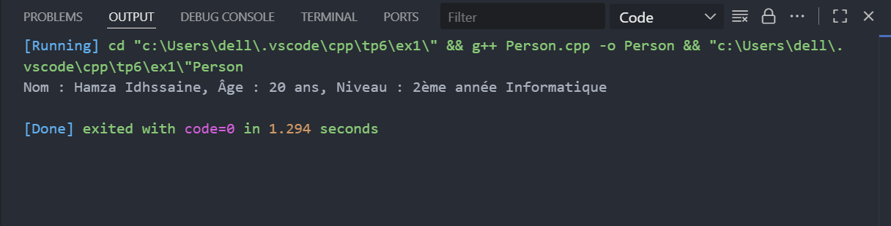
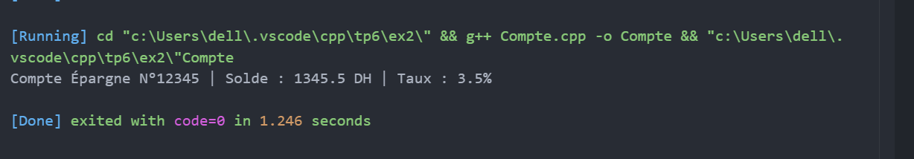
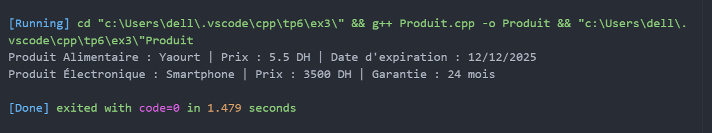

# TP6 : Programmation Orientée Objet en C++

## Exercice 1, 2 ,3 & 4 — Personne & Étudiant, Compte bancaire, Hiérarchie de produits

---

### Objectif pédagogique  
Apprendre l’héritage simple, le polymorphisme, et la gestion des méthodes spécialisées en C++.

---

## Exercice 1 : Personne et Étudiant

### Description  
Créer une classe **Personne** avec `nom` et `age`, et une classe dérivée **Etudiant** avec un attribut `niveau`.  
Ajouter une méthode `afficher()` pour afficher les informations.

---

### Fonctionnalités  
- Héritage public entre Personne et Etudiant.  
- Constructeurs avec appel au constructeur de base.  
- Redéfinition de la méthode `afficher()`.

---

### Résultat attendu  
Nom : Hamza Idhssaine, Âge : 20 ans, Niveau : 2ème année Informatique

---

## Exercice 2 : Compte bancaire

### Description  
Créer une classe **Compte** avec `numero` et `solde`.  
Créer une classe dérivée **CompteEpargne** avec `tauxInteret` et méthode `calculerInteret()`.

---

### Fonctionnalités  
- Dépôt et retrait d’argent.  
- Calcul d’intérêts sur compte épargne.  
- Affichage des informations.

---

### Résultat attendu  
Compte Épargne N°12345 | Solde : 1300 DH | Taux : 3.5%

---

## Exercice 3 : Hiérarchie de produits

### Description  
Créer une classe **Produit** avec `nom`, `prix` et méthode virtuelle `afficherInfos()`.  
Créer deux classes dérivées : **ProduitAlimentaire** (avec `dateExpiration`) et **ProduitElectronique** (avec `garantie`).

---

### Fonctionnalités  
- Polymorphisme via méthode virtuelle.  
- Redéfinition de `afficherInfos()` dans chaque classe dérivée.

---

### Résultat attendu  
Produit Alimentaire : Yaourt | Prix : 5.5 DH | Date d'expiration : 12/12/2025  
Produit Électronique : Smartphone | Prix : 3500 DH | Garantie : 24 mois

---

## Exercice 4 : Système de gestion d’employés

### Description  
Créer une classe de base **Employe** avec `nom`, `id`, `salaireDeBase` et une méthode virtuelle `afficherInfos()`.  
Créer deux classes dérivées :  
- **Permanent** avec un attribut `primeAnnuelle`.  
- **Contractuel** avec `dureeContrat` (en mois) et `tauxHoraire`, et une méthode `calculerSalaireMensuel(int heures)`.

---

### Fonctionnalités  
- Héritage public avec redéfinition de méthodes.  
- Polymorphisme via `afficherInfos()`.  
- Gestion dynamique d’objets via pointeurs vers la classe de base.  
- Destructeur virtuel pour une bonne gestion mémoire.

---

### Résultat attendu  
Affichage des informations complètes pour chaque employé, avec calcul du salaire mensuel pour les contractuels.

